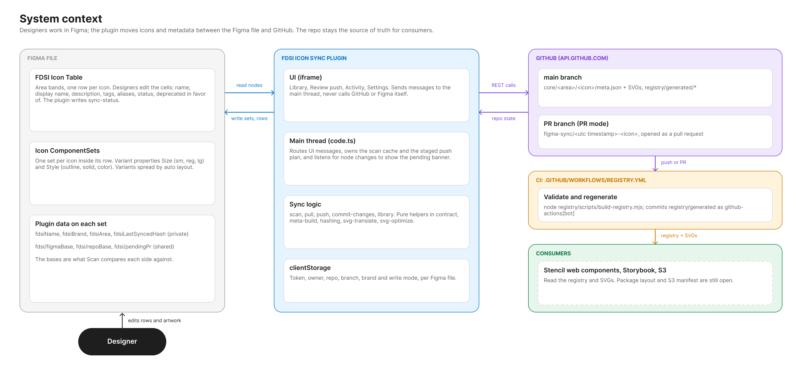
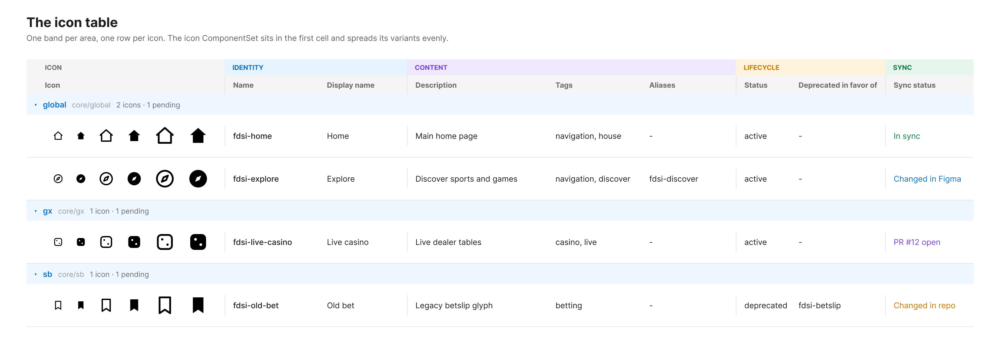
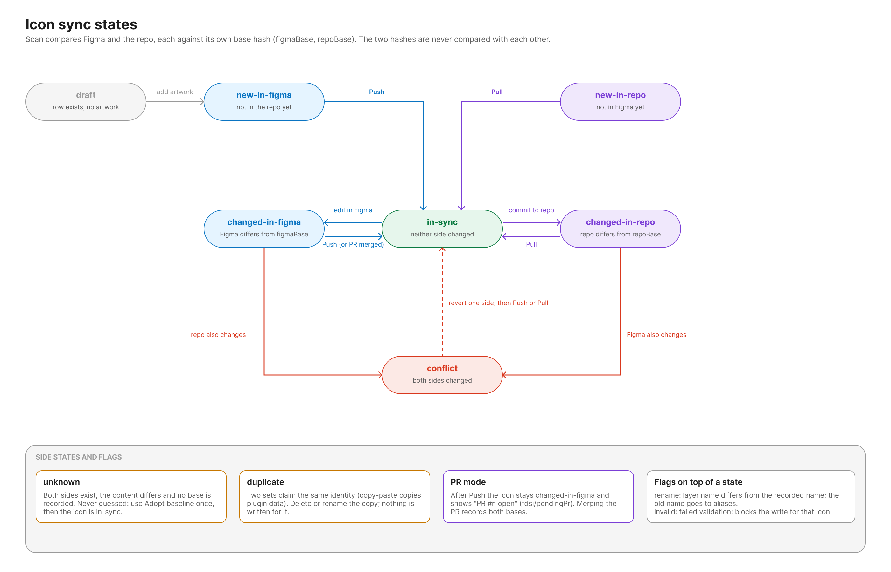

# FDSI Icon Repository

Managed, multi-tenant SVG icon repository for the FDSI design system. Icons are stored with a semantic naming scheme (`fdsi-<use-case>-<size>-<style>.svg`) and described by a per-icon `meta.json`, so they can be consumed by apps, validated by tooling, and kept in sync with the Figma icon library through the [Figma sync plugin](figma-sync/README.md).

Consumers: web components (StencilJS), Storybook, S3.



## Structure
```
/core             brand-agnostic shared icons, grouped by area (global, bx, gx, sb, payments, ...)
/registry         JSON Schemas, generation scripts and generated registry aggregates
/figma-sync       Figma plugin: bi-directional sync between the Figma icon table and this repo
/docs             naming conventions, multi-brand policy, contribution guide, Figma contract and plan
/.github          CI workflow that validates icons and regenerates the registry
```

Each icon lives in `core/<area>/<icon-name>/` with its `meta.json` and its size and style variants.

## Figma sync

Designers maintain icons in a Figma table: one band per area, one row per icon, and the icon ComponentSet (variants `Size` x `Style`) inside its row.



The plugin compares each side with the state recorded at the last sync and shows which icons are new, changed, in conflict or in sync. Push validates and optimises the artwork and commits it (directly, or on a branch with a pull request). Pull creates or updates the Figma sets from the repo.



> The Figma images are designed replicas of the table structure and the plugin UI, not captures of the running plugin. The plugin is implemented and unit-tested but has not yet been run against a real Figma file and GitHub repo.

Everything about the plugin (architecture, table anatomy, push and pull flows, UI, settings, troubleshooting) is in [figma-sync/README.md](figma-sync/README.md). The design decisions and phased plan are in [docs/figma-contract-and-plan.md](docs/figma-contract-and-plan.md).

## Registry

`registry/generated/*` is produced and validated by `node registry/scripts/build-registry.mjs`. The workflow [.github/workflows/registry.yml](.github/workflows/registry.yml) runs it on every change to `core/**`, the schemas or the scripts, fails on invalid `meta.json`, naming, size or alias problems, and commits the regenerated files. Do not edit `registry/generated` by hand.

## Docs

- [docs/naming-conventions.md](docs/naming-conventions.md)
- [docs/multi-brand.md](docs/multi-brand.md)
- [docs/contributing.md](docs/contributing.md)
- [docs/figma-contract-and-plan.md](docs/figma-contract-and-plan.md)
- [docs/icon-component-approaches.md](docs/icon-component-approaches.md)
- [docs/handoff-and-plan.md](docs/handoff-and-plan.md)
- [figma-sync/README.md](figma-sync/README.md)
