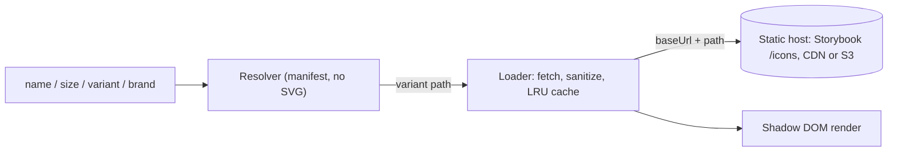

# Icon component: approaches and metadata delivery

Status: proposal for discussion. Scope: `fds-icon` (Stencil web component) and how icon metadata (`meta.json`) reaches Storybook and consumers.

## 1. Context

- This repo is the source of truth for icons: `core/<area>/<icon>/meta.json` plus SVGs named `fdsi-<name>-<sm|reg|lg>-<outline|solid|color>.svg`.
- Icons are published to S3 and used in Figma (via the `figma-sync` plugin).
- The existing `fdsp-icon` component (PR 49703) loads SVGs at runtime from a CDN.
- Question: how should the new `fds-icon` resolve and load icons, and where does `meta.json` data live at runtime?

## 2. The two approaches

### A. `fdsp-icon` (existing, as read from master)

The consumer passes an icon name. The component builds the URL, fetches the SVG, sanitizes it and caches it.

- Runtime fetch with an LRU cache.
- Sanitization (DOMParser in the browser, string-based on the server).
- SSR support.
- Accessibility via an SVG title.
- Rotate, mirror and a colour token (`--libfds-icon-color`).
- No registry metadata: it does not know about aliases, deprecation, available sizes/styles, or which area an icon belongs to.

### B. Sandbox `fds-icon` v1 (embedded)

A build step reads every `meta.json` and SVG and generates a TypeScript module. The component resolves everything from that module and inlines the SVG.

- Metadata-aware resolution: aliases, deprecated-to-replacement redirect, nearest-size/style fallback, brand-to-`core` fallback.
- Search by name, alias, area, tag and description (for the Explorer story).
- No network requests; works offline.
- Every SVG ships in the JS bundle, so bundle size grows with the library, and a new icon needs a new component release.

### Hybrid (what is implemented now)

Our resolver sits in front of a runtime loader like A's.

1. The manifest (names, aliases, status, variants, paths; no SVG content) resolves the request to a repo-relative path such as `core/global/fdsi-home/fdsi-home-reg-solid.svg`.
2. The loader fetches `baseUrl + path`, sanitizes it, caches it and shares in-flight requests.
3. The component renders it, with rotate, mirror and `--fds-icon-color`.

## 3. Comparison

| Concern | A: `fdsp-icon` | B: embedded | Hybrid |
| --- | --- | --- | --- |
| Icons in JS bundle | No | Yes (all) | No |
| New icon needs component release | No | Yes | No, if the manifest is also fetched (see section 4) |
| Aliases / deprecation redirect | No | Yes | Yes |
| Size/style fallback | No | Yes | Yes |
| Search by metadata | No | Yes | Yes |
| First paint | Network round trip | Immediate | Network round trip |
| SSR | Yes | Trivial | Not implemented |
| Offline | Needs cache | Yes | Needs cache |
| Sanitization | Yes | Not needed (build-time trusted) | Yes |
| Typo in `name` | Fails at runtime (404) | Warns, renders a placeholder | Warns, renders a placeholder |

Size scale: we keep `sm = 16`, `reg = 24`, `lg = 48` (agreed). Components using their existing sizes would need a mapping or migration.

## 4. How does `meta.json` get to Storybook and consumers?

Options for where metadata lives at runtime:

| Option | How | Pros | Cons |
| --- | --- | --- | --- |
| 1. Bundled into the component at build time (current) | `storybook/scripts/build-icons.mjs` reads `core/**/meta.json` through `registry/scripts/load-icons.mjs` and generates `src/generated/icons.ts`. | No extra request; types are generated; fails the build on invalid metadata; simple. | A new or changed icon needs a component rebuild. Manifest size grows with the library and ships to every consumer. |
| 2. `manifest.json` published next to the SVGs (S3/CDN), fetched at runtime | The registry build emits one file that is uploaded with the icons. The component fetches it once and caches it. | Icons and metadata ship together, with no component release per icon. One source for Storybook, the component and other tools. | One more request on first use. The component must handle fetch failure and versioning. The published manifest and SVG set must stay consistent. |
| 3. Each `meta.json` published and fetched per icon | Upload every `meta.json` beside its SVGs. | Trivial upload. | Cannot resolve aliases or search without a full index, so it needs option 2 as well. Not recommended on its own. |

### Role of `registry/generated/*`

The generator in `registry/scripts/build-registry.mjs` already produces the index files:

- `index.json`: brands and areas.
- `<area>.icons.json`: per-area icon records.
- `aliases.index.json`: alias to icon name.

These are derived from `meta.json`, which is the only hand-edited input. The Storybook build reads `meta.json` directly rather than the generated files, so there is one validation path and no stale-copy problem.

### Recommendation

One generator, two outputs, both derived from `core/**/meta.json`:

1. `manifest.json` (slim, runtime): name, aliases, status, replacement, variants (size, style, path). No descriptions or tags.
2. `icons.index.json` (full, tooling): everything above plus displayName, description, tags, area and Figma ids. Used by Storybook search and the Explorer.

Delivery:

- Storybook: build-time generation (option 1) is fine, since it is already rebuilt with the repo.
- Production component: option 2. Publish `manifest.json` next to the SVGs in the same CI job so the two cannot drift.
- If a bundled fallback is needed (SSR, offline), embed the slim manifest only.

Why not embed the full metadata in production: it grows linearly with the library and carries data (descriptions, tags, Figma ids) that rendering never uses.

## 5. Open decisions

1. Is metadata lookup at runtime acceptable for production, or must the component work without a manifest request (embed the slim manifest)?
2. S3/CDN layout: the loader appends `<brand>/<area>/<icon>/<file>.svg` to `baseUrl`. Does the bucket mirror the repo layout, or do we add a path mapping step in the publish job?
3. Cache and versioning: version the manifest and SVGs together (path prefix or content hash) or use a mutable "latest"?
4. Colour API: `--fds-icon-color` or their `--libfds-icon-color`?
5. Sizes: keep sm/reg/lg or map to the existing size names?
6. SSR and `<title>` tooltip: needed in the first release?

## 6. Not yet done / known gaps

- Visual verification in a browser (not possible in the current environment); builds and the sanitizer were tested only through Node.
- SSR, `<title>` injection and `externalUrl` are not implemented.
- A true in-panel Storybook search box needs a custom addon; the Playground uses a text control with a clickable match list instead.
- The slim `manifest.json` output from `build-registry.mjs` is not yet implemented; the component currently embeds the full records from `build-icons.mjs`.
