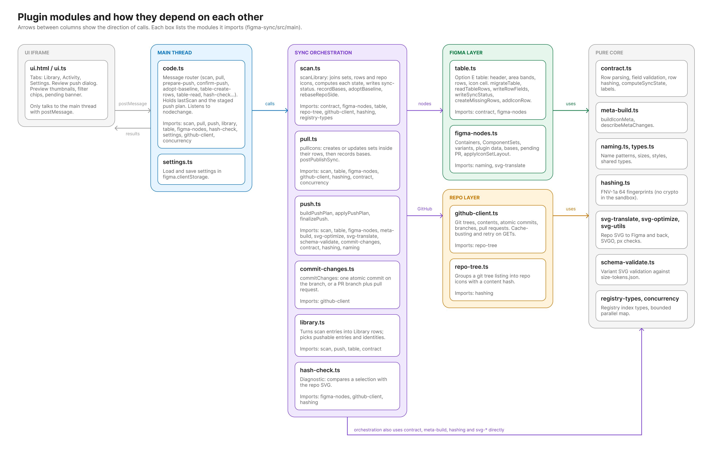
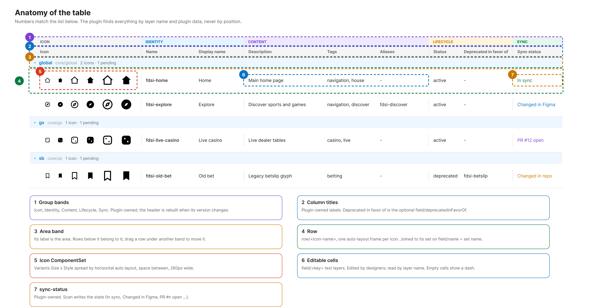
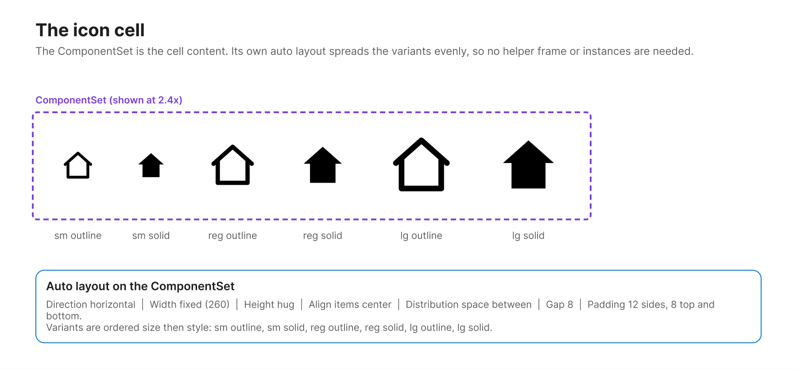
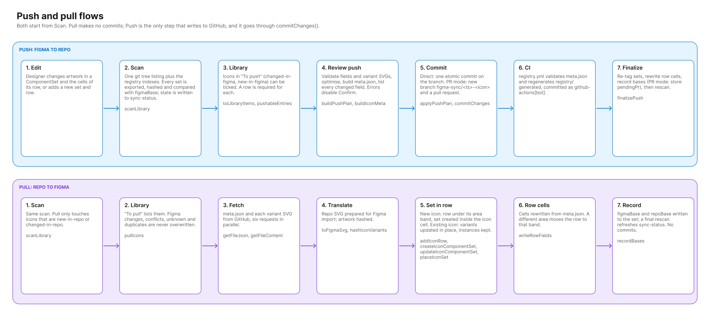
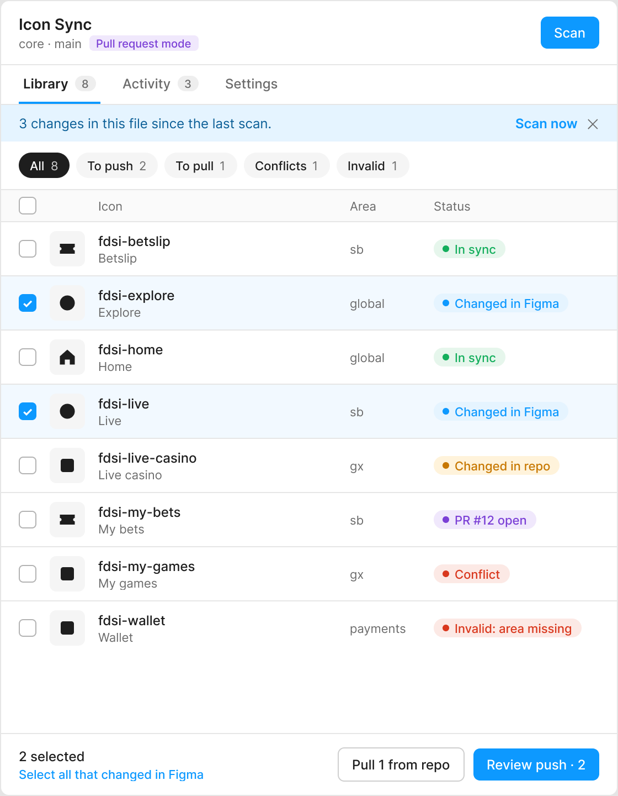
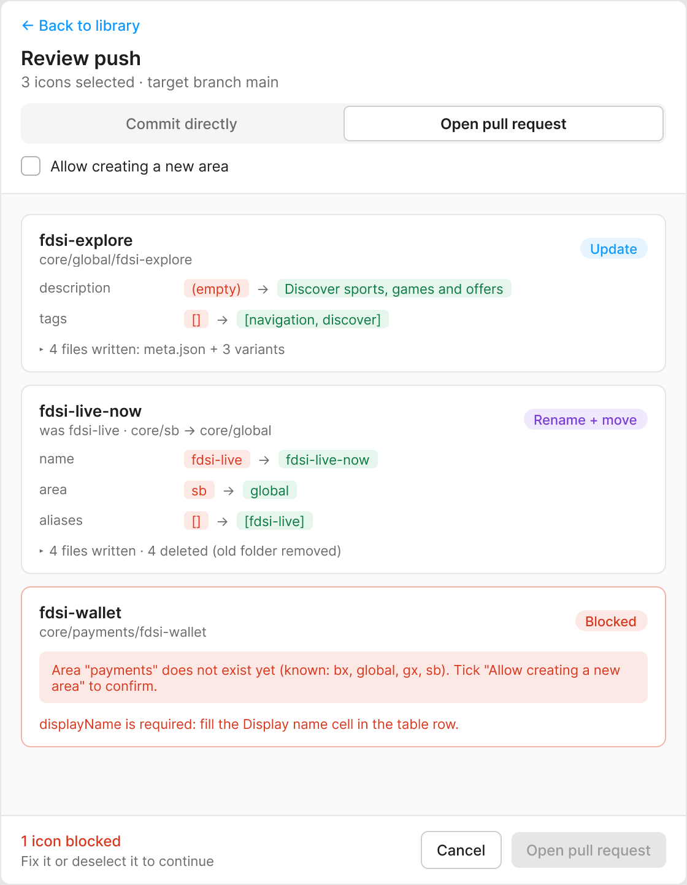
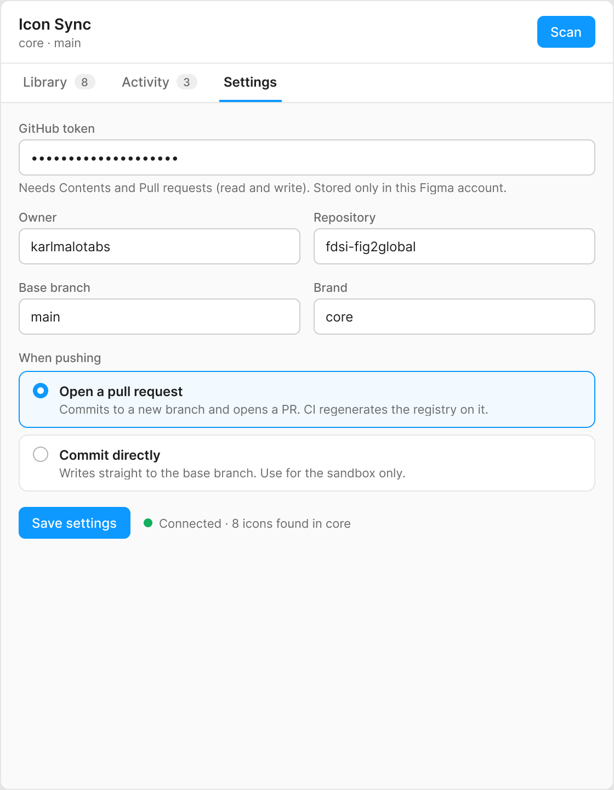
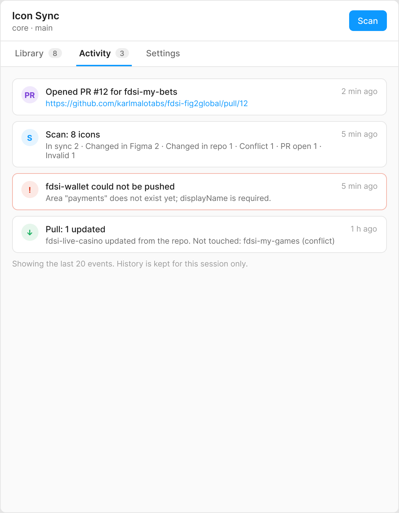

<p align="center">
  
</p>

<h1 align="center">FDSI Icon Sync (Figma plugin)</h1>

A Figma plugin that keeps the FDSI icon library in Figma and this repository in sync, in both directions. Designers work in a Figma table (one row per icon, one ComponentSet per icon). The plugin pushes artwork and metadata to GitHub and pulls repo changes back into the table. The repo stays the source of truth for consumers (web components, Storybook, S3).

> **Status: implemented, not yet runtime-tested.** Everything type-checks, builds and passes the unit tests (7 files), but it has not been run in a real Figma session against a real GitHub repo. Try it in a scratch Figma file and a scratch repo (or a branch) first.
>
> **About the images.** The diagrams, the table renders and the UI screens in this document were designed in Figma. The table images are replicas of the structure the plugin builds (sample data), and the UI screens are the design mockups of the plugin UI. They are not captures of the running plugin.

## Contents

1. [What it does](#what-it-does)
2. [Architecture](#architecture)
3. [The Figma table](#the-figma-table)
4. [Sync states](#sync-states)
5. [Push and pull](#push-and-pull)
6. [Plugin UI tour](#plugin-ui-tour)
7. [Settings and write modes](#settings-and-write-modes)
8. [Designer guide](#designer-guide)
9. [Reference](#reference)
10. [Build, test, install](#build-test-install)
11. [Troubleshooting](#troubleshooting)
12. [Known limitations](#known-limitations)
13. [Related docs](#related-docs)

## What it does

| Capability | Description |
| --- | --- |
| **Scan** | Lists the repo with one git tree call, reads the Figma sets and rows, joins them by icon name and computes a sync state for each icon. Read-only. |
| **Pull** | Creates or updates ComponentSets (and their rows) from `core/<area>/<icon>/meta.json` and the variant SVGs. Never writes to the repo. |
| **Push** | Validates, optimises and translates the artwork, builds `meta.json`, shows a review of every change, then commits (directly, or on a branch with a pull request). |
| **Create missing rows** | Gives every ComponentSet without a row a row in the table. Figma only. |
| **Adopt baseline** | Resolves `unknown` icons (both sides exist, no base recorded) by recording the current state as the base, after you confirm they match. |
| **Table migration** | Upgrades older tables (v1/v2) to the current layout and moves existing sets into their rows. |
| **Diagnostics** | Hash check: compares a selection with the repo SVG. |


## Architecture

The plugin has two halves. The UI iframe only renders and sends messages. The main thread owns the Figma API and all network calls. Business rules (validation, hashing, state computation, translation) live in pure modules with unit tests and no Figma dependency.



### Why some things look unusual

The Figma plugin sandbox has no `TextEncoder`, `DOMParser` or `crypto`, so:

- hashing is FNV-1a 64 (fingerprints, not security),
- SVG handling is regex-based (`svg-utils.ts`),
- the UI is a single `dist/ui.html` with the script inlined,
- GitHub GET requests use cache-busting and retry (the sandbox fetch can return stale or flaky responses).

## The Figma table

One table, `FDSI Icon Table`, lives in a frame flagged in plugin data. It has area bands, and under each band one row per icon. The icon ComponentSet sits inside its row's icon cell.


### Anatomy



```
Page: Icons
 └ FDSI Icon Library              root frame (flagged in plugin data)
    └ FDSI Icon Table
       ├ header                   group bands + column titles (plugin-owned)
       ├ area/<area>              band; its label is the area, rows below it belong to it
       ├ row/<icon-name>          one auto-layout frame per icon
       │  ├ icon cell             holds the icon ComponentSet
       │  ├ identity cell         field/name, field/displayName
       │  ├ content cell          field/description, field/tags, field/aliases
       │  ├ lifecycle cell        field/status, field/deprecatedInFavorOf
       │  └ sync cell             sync-status (plugin-owned, read-only)
       └ area/<next area> ...
```

Rules the plugin relies on:

- Containers are found by plugin-data flag, not by name, so renaming a frame is safe.
- Rows are read by `field/<key>` layer names, never by column position or nesting.
- A row's area is the band above it. Dragging a row under another band changes its area. Retyping a band label (or duplicating a band and typing a new area) starts a new area.
- A row and a set are joined on icon name: `field/name` equals the set name.
- Variants are Components named `Size=<sm|reg|lg>, Style=<outline|solid|color>`.

### The icon cell

The ComponentSet is the cell content. Its own auto layout (horizontal, space between, fixed 260 px wide) spreads the variants evenly, so the table needs no instances or helper frames.



### Field rules

Validated before any write; errors block that icon in the review dialog.

| Field | Rule |
| --- | --- |
| `name` | `^fdsi-[a-z0-9]+(-[a-z0-9]+)*$`, unique per brand |
| `area` | Required; known to the repo, or explicitly confirmed as new |
| `displayName` | Free text, required for new icons |
| `description` | Free text, optional |
| `tags` | Comma-separated, lowercase, stored as an array |
| `aliases` | Comma-separated, stored as an array. Looser pattern than `name` (legacy `fdsi-live_casino`). A rename appends the old name automatically. |
| `status` | `active`, `deprecated` or `draft`. `deprecated` needs `deprecatedInFavorOf` to name an existing icon. |
| variants | Allowed size and style enums; each SVG passes `validateVariantSvgs` and the px check from `registry/schema/size-tokens.json` |

An empty cell shows a dash (`—`), which the plugin reads as empty.

## Sync states

Two base hashes are stored as shared plugin data on every ComponentSet: `figmaBase` (the Figma content when last synced) and `repoBase` (the repo content when last synced). Each side is compared only with its own base, so there is never a cross-format hash comparison. `lastSyncedHash` in `meta.json` is an audit value written by Push.


| State | Meaning | What to do |
| --- | --- | --- |
| `draft` | Row exists, no artwork yet | Add artwork |
| `new-in-figma` | In Figma, not in the repo | Push |
| `new-in-repo` | In the repo, not in Figma | Pull |
| `in-sync` | Neither side changed since the base | Nothing |
| `changed-in-figma` | Figma differs from `figmaBase` | Push |
| `changed-in-repo` | Repo differs from `repoBase` | Pull |
| `conflict` | Both changed | Revert one side, then Push or Pull. Never overwritten automatically. |
| `unknown` | Both exist, content differs, no base | Adopt baseline once |
| `duplicate` | Two sets claim one identity | Delete or rename the copy |

Flags on top of a state: `rename` (layer name differs from the recorded name; the old name goes to `aliases`) and `invalid` (validation failed; blocks the write for that icon). In PR mode an icon stays `changed-in-figma` and shows `PR #n open` until the PR is merged.

The logic is `computeSyncState` in [src/main/contract.ts](src/main/contract.ts), covered by [tests/contract.test.ts](tests/contract.test.ts) and [tests/scan.test.ts](tests/scan.test.ts).

## Push and pull



### Push

1. **Scan** to learn the state of every icon.
2. In the **Library**, tick icons in "To push" (`changed-in-figma`, `new-in-figma`). A row is required.
3. **Review push** runs `buildPushPlan`: validates fields and SVGs, optimises SVGs, builds `meta.json`, lists every changed field and file. Any error disables Confirm.
4. **Confirm** runs `applyPushPlan` and `commitChanges`:
   - `direct`: one atomic commit on the configured branch.
   - `pr`: a new branch `figma-sync/<timestamp>-<icon>` plus a pull request.
5. CI (`registry.yml`) validates `meta.json` and regenerates `registry/generated`.
6. `finalizePush` re-tags the sets, rewrites the row cells, records the bases (PR mode stores `pendingPr` instead) and rescans.

### Pull

1. **Scan.**
2. In the Library, "To pull" lists `new-in-repo` and `changed-in-repo`. Figma changes, conflicts, `unknown` and `duplicate` icons are never overwritten.
3. The plugin fetches `meta.json` and each variant SVG (parallel, bounded), translates the SVG for Figma, then:
   - new icon: `addIconRow` creates the row under its area band and `createIconComponentSet` builds the set inside the icon cell,
   - existing icon: variants are updated in place (instances are kept) and `placeIconSet` moves the set into its row.
4. `writeRowFields` rewrites the cells from `meta.json`; a different area moves the row to that band.
5. `recordBases` writes both bases, and a rescan refreshes `sync-status`. Pull makes no commits.

### Registry regeneration

`.github/workflows/registry.yml` runs `node registry/scripts/build-registry.mjs` on pushes to `main` and on pull requests that touch `core/**`, the schemas or the scripts. It fails on invalid `meta.json`, naming, size or alias problems, and commits `registry/generated/*` as `github-actions[bot]` (onto the PR branch in PR mode). Pull requests from forks are validated only.

## Plugin UI tour

The screens below are the UI design. The UI has four views.

| Library | Review push |
| --- | --- |
|  |  |
| Icons grouped by state with previews, filter chips and a pending-PR banner. Select the icons to push or pull. | Every change before it is written: files, metadata differences and validation errors. Confirm is disabled while errors exist. |

| Settings | Activity |
| --- | --- |
|  |  |
| Token, owner, repo, branch, brand and write mode. | Log of scans, pulls, pushes and errors from this session. |

## Settings and write modes

Stored in `figma.clientStorage` (per Figma user and machine), key `fdsi-sync-settings`.

| Setting | Notes |
| --- | --- |
| Token | A fine-grained personal access token limited to this repo: **Contents: read and write**, plus **Pull requests: read and write** if you use PR mode. Treat it as sensitive. |
| Owner / Repo | The repository, for example `karlmalotabs` / `fdsi-fig2global`. |
| Branch | The base branch. Direct mode commits to it; PR mode branches from it. |
| Brand | Defaults to `core`. Selects `core/` or a brand folder. |
| Write mode | `direct` (default) or `pr`. |

The only network access the plugin declares is `https://api.github.com` ([manifest.json](manifest.json)).

## Designer guide

- **Add an icon**: create the ComponentSet with variants `Size=…, Style=…` and name it `fdsi-<name>`. Run **Create missing rows**, fill the cells, then Push.
- **Change artwork**: edit the variants, Scan, Push.
- **Change metadata**: edit the cells (`field/…` text layers). Do not rename the layers.
- **Change the area**: drag the row under another area band, or retype a band label.
- **Rename an icon**: rename the set and the `field/name` cell together. The old name is appended to `aliases` automatically.
- **Deprecate**: set `status` to `deprecated` and fill `deprecatedInFavorOf`.
- **Never edit** the header, the band counts or `sync-status`. The plugin rewrites them.

## Reference

### Messages (UI to main thread)

The UI talks to the main thread with `postMessage`; the main thread answers with result and progress messages. Requests handled in [src/main/code.ts](src/main/code.ts):

| Message | Effect |
| --- | --- |
| `ui-ready` | Load settings and send the initial state |
| `save-settings` | Store settings in `clientStorage` |
| `scan` | `scanLibrary`, then send entries and previews |
| `pull` | `pullIcons` for the selected icons |
| `prepare-push` | `buildPushPlan` and stage the plan |
| `confirm-push` / `cancel-push` | `applyPushPlan` and `finalizePush`, or discard the staged plan |
| `adopt-baseline` | Record the current state as the base for `unknown` icons |
| `table-create-rows` | Create missing rows, migrate the table, move sets into rows |
| `table-read` | Read and validate the table without writing |
| `post-publish-sync` | Capture `componentKey` after a manual library publish |
| `hash-check` | Compare a selection with its repo SVG |
| `focus-icon` | Select and zoom to an icon |
| `dismiss-changes` | Clear the "changed since last scan" banner |
| `resize` | Resize the plugin window |

### Modules ([src/main](src/main))

| Module | Responsibility |
| --- | --- |
| `code.ts` | Message router, scan cache, staged push plan, `nodechange` listener |
| `scan.ts` | `scanLibrary`, state computation, `recordBases`, `adoptBaseline`, `rebaseRepoSide` |
| `pull.ts` | `pullIcons`, `postPublishSync` |
| `push.ts` | `buildPushPlan`, `applyPushPlan`, `finalizePush` |
| `commit-changes.ts` | Atomic commit, or branch plus pull request |
| `library.ts` | Library rows and push/pull selection |
| `table.ts` | Table creation, bands, rows, migration, read/write of cells, `sync-status` |
| `figma-nodes.ts` | Containers, ComponentSets, variants, plugin data, auto layout |
| `github-client.ts` / `repo-tree.ts` | GitHub REST access and tree grouping |
| `contract.ts` | Row parsing, validation, hashing, `computeSyncState` |
| `meta-build.ts` | `buildIconMeta`, `describeMetaChanges` |
| `svg-translate.ts` / `svg-optimize.ts` / `svg-utils.ts` | Repo SVG to Figma and back, optimisation, px checks |
| `schema-validate.ts` | Variant SVG validation against `size-tokens.json` |
| `hashing.ts`, `naming.ts`, `types.ts`, `registry-types.ts`, `concurrency.ts`, `settings.ts` | Shared helpers |

### Plugin data on each ComponentSet

| Key | Visibility | Purpose |
| --- | --- | --- |
| `fdsiName`, `fdsiBrand`, `fdsiArea`, `fdsiLastSyncedHash` | private | Identity and audit hash |
| `figmaBase`, `repoBase` (namespace `fdsi`) | shared | The two bases used to compute state |
| `pendingPr` (namespace `fdsi`) | shared | Open PR for the icon (PR mode), stored as JSON |

## Build, test, install

```sh
cd figma-sync
npm install
npm run build            # dist/code.js and dist/ui.html
npm run typecheck        # tsc --noEmit
npm test                 # unit tests (tests/*.test.ts)
npm run verify:github-read   # read-only check against the live repo
```

Install in Figma desktop: **Plugins, Development, Import plugin from manifest…**, then pick `figma-sync/manifest.json`. The manifest `id` is a placeholder (`REPLACE_WITH_REGISTERED_PLUGIN_ID`); replace it with a registered id before sharing the plugin.

Plugin icon (monogram, inverted variant C): [assets/icon-128.png](assets/icon-128.png), [assets/icon-256.png](assets/icon-256.png) and [assets/icon.svg](assets/icon.svg). Figma has no manifest field for it; upload the 128 px (or 256 px) PNG in the publish dialog. The same mark is inlined in the plugin header in [src/ui/ui.html](src/ui/ui.html).

## Troubleshooting

| Symptom | Likely cause |
| --- | --- |
| Scan fails with 401 or 403 | Token missing, expired or without Contents permission |
| Push fails with 404 on the branch | Branch name in Settings does not exist |
| PR mode fails to open the PR | Token lacks Pull requests permission |
| Icon shows `unknown` | No base recorded (first run on an existing library): use Adopt baseline after checking both sides match |
| Icon shows `duplicate` | A set was copy-pasted and kept its plugin data: delete or rename the copy |
| Stale data right after a push | CI is still regenerating `registry/generated`; rescan in a moment |
| Rows moved after migration | Table v3 moves existing sets into their rows by design |
| `componentKey` empty | The library has not been published yet |

## Known limitations

- **Not yet tested in real Figma and GitHub.** Phases 3 to 5a and Table v3 are validated by typecheck, unit tests and build only.
- **Previews are alpha masks**, not the colour artwork.
- **Scan exports every variant** to hash it, which is slow on large libraries.
- **Icon-level hashing**: any variant change marks the whole icon changed.
- **`componentKey` needs a manual publish.** The Plugin API cannot publish a library; run Post-publish sync afterwards.
- **PAT in `clientStorage`** is acceptable for an internal tool but is not a secret store. Consider a GitHub App with a relay backend before wider rollout.
- **Migration moves sets into rows** the first time it runs on an older table.
- **PR mode relies on branch protection and CI** on your side for the actual merge gate.

## Related docs

- [docs/figma-contract-and-plan.md](../docs/figma-contract-and-plan.md): decisions, structure contract, state model, flows, phased plan, risks
- [docs/naming-conventions.md](../docs/naming-conventions.md)
- [docs/multi-brand.md](../docs/multi-brand.md)
- [docs/contributing.md](../docs/contributing.md)
- [registry/generated/README.md](../registry/generated/README.md)
